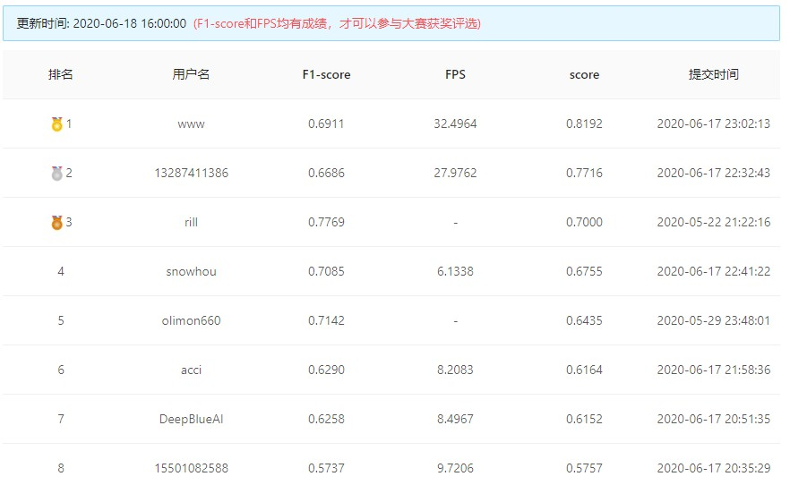
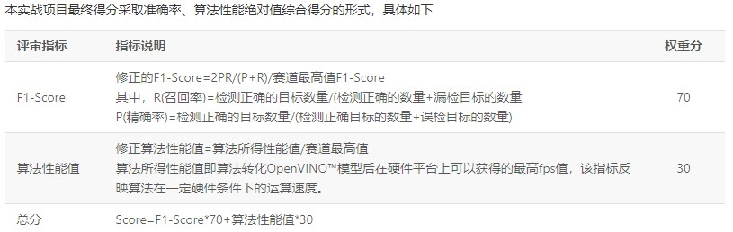

## 极市口罩检测 No.1
<div align="center"></div>

问题描述：检测图片中戴口罩和没戴口罩的人脸，F1-score 和 FPS 需要 trade-off

<div align="center"></div>

模型：
```
Centernet + ttfnet
Backone：mobilenetv2(0.5，relu替换relu6)
neck：   4层FPN + ASFF融合 + SSH
后处理：  softnms
大小大概：2 Mb
(ps: 由于平台C++测速bug，导致我以为这个模型速度不快，训练一次后放弃优化，故精度是没有优化过的, 800x640分辨率F1-score大概0.76)
```

原始ttfnet结构

<div align="center"></div>

代码层面优化：
```
1、查表法减均值除方差
2、图像W/H原比例缩放和填充input_ptr合并
3、尽量减少多余乘法，数组替换vector
(resize也有点耗时，听说Opencv4.2加速了)
```